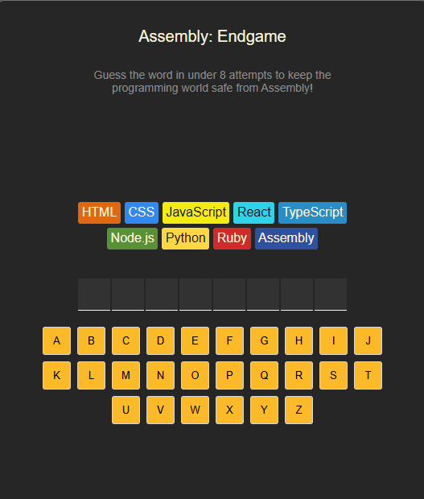
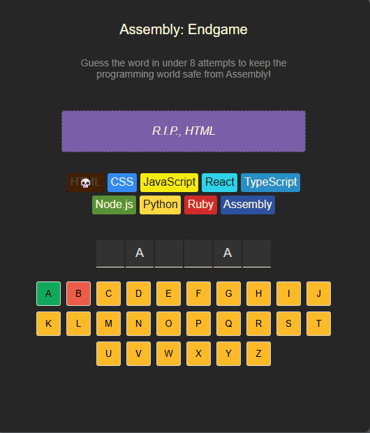
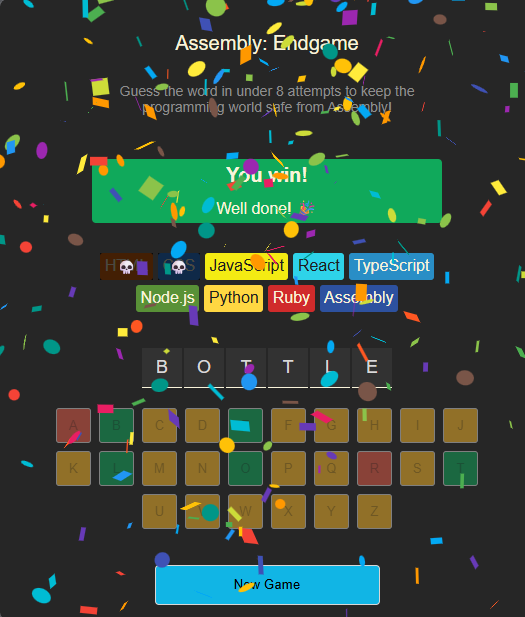
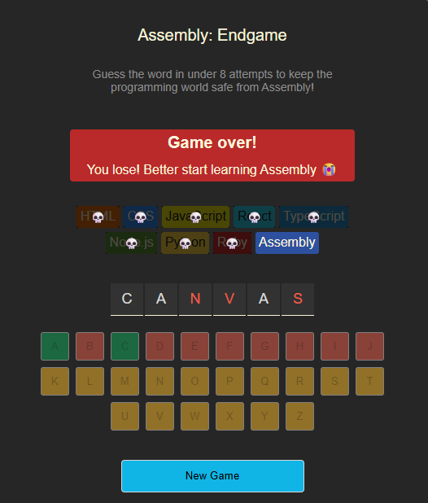

# 🎮 Assembly Endgame

**Assembly Endgame** is a fun and interactive word-guessing game built with React. Inspired by classic games like Hangman, it challenges you to guess the hidden programming-related word within a limited number of guesses. Incorrect guesses “eliminate” a programming language — and you win when you guess the word correctly before all languages are gone!

---

## 🚀 Features

- 🎯 Word-guessing gameplay: Guess one letter at a time to reveal the hidden word.  
- 🧠 Programming language elimination: Each wrong letter guess removes a language from the list.  
- ✅ Win / ❌ Lose states: Game ends when the word is fully revealed (you win) or when languages run out (you lose).  
- 🔁 Restart option: Start a new game with a fresh word and list.  
- 🔧 Responsive UI: Works across desktop and mobile.  
- 🖼️ Rich visual feedback: Buttons, status messages, and optional animations.

---

## 📸 Screenshots

### New Game


### Correct Guess


### Wrong Guess


### Game Won


### Game Lost


---

## 🛠️ Tech Stack

| Layer        | Technologies                        |
|--------------|-------------------------------------|
| Frontend     | React (function components + hooks) |
| Styling      | CSS / your chosen styling solution  |
| Build Tool   | Vite                                |
| Logic        | JavaScript – state & conditional UI |

---

## 📦 Getting Started

### Prerequisites  
- Node.js (v14 or above)  
- npm or yarn

### Installation  
1. Clone the repository  
     ```bash
     git clone https://github.com/TasinTausif/AssemblyEndgame.git
     cd AssemblyEndgame

2. Install dependencies
     ```bash
      npm install

3. Start the development server
    ```bash
      npm run dev

4. Open your browser and go to the URL displayed (typically http://localhost:5173).

## 🎮 How to Play

The game chooses a random programming-related word.

You see a list of programming languages (your “lives” / chances).

Guess a letter by clicking a button on the on-screen keyboard:

If correct → The letter is revealed in the word.

If incorrect → One language gets eliminated (visual feedback).

You win if you reveal the entire word before all languages are gone.

You lose if you make too many incorrect guesses and run out of languages.

Use the New Game button to reset and play again.
